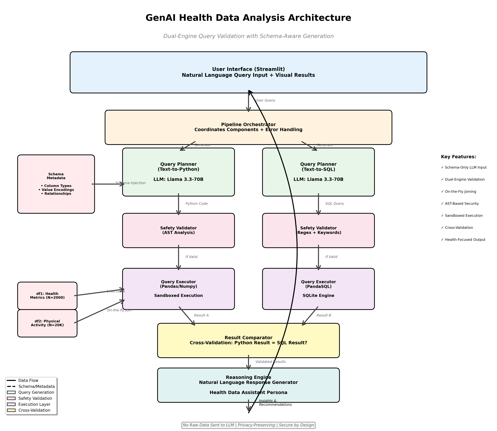

# GenAI Health Data Analysis Solution

A GenAI-powered chatbot for analyzing health data using natural language queries. Built with a text-to-Python/Pandas approach using Groq API and Streamlit.

## 🎯 Overview

This solution enables users to query health datasets using natural language and receive contextual insights and recommendations. The system:
- Converts natural language to Python/Pandas queries
- Executes queries with on-the-fly data joining (no permanent consolidation)
- Generates natural language responses with health insights
- Shows intermediate query outputs for transparency

## 📋 Case Study Alignment

This project is built to address the specific requirements outlined in the **"Development of a Custom GenAI Solution for Conducting Health Data Analysis"** case study.

### Alignment Highlights:
- **On-the-fly Data Integration**: As per the objective to avoid permanent data consolidation, our `QueryExecutor` joins `df1` and `df2` in-memory during query execution.
- **Interim Query Output**: The system generates Python/Pandas code as an intermediate step (visible in the "Logic" tab of the UI) before fetching results.
- **Ethical Integrity**: Implements schema-only LLM injection to preserve patient privacy and includes automated medical disclaimers in all generated insights.
- **Continuous Evaluation**: Features a dedicated `HealthEvaluator` using G-Eval to quantify response quality across key dimensions.

## 🏗️ Architecture

The solution implements an **Agentic Data Analyst Pipeline** using a Planner-Executor-Reasoner pattern. This ensures a clean separation between natural language understanding, data processing, and insight generation.

### 🔄 Technical Flow Deep-Dive

The core architecture follows a secure, linear processing pipeline that ensures data privacy while delivering deep health insights.

<p align="center">
  
</p>

### Key Components

*   **Query Planner**: Uses LLM (Llama 3.3) and metadata-injected prompts to translate natural language into optimized Python/Pandas operations. It relies on a rich interpretation guide for health-specific thresholds.
*   **AST Safety Validator**: Performs static analysis on the generated code to prevent code injection, file system access, and other non-standard library operations.
*   **Query Executor**: Executes the validated code in a sandboxed environment. It performs on-the-fly joining of multiple datasets (e.g., patient metrics and activity logs) without persistent consolidation.
*   **Reasoning Engine**: Interprets the raw statistical output from the executor to provide professional, context-aware insights and health recommendations.
*   **G-Eval Evaluator**: An AI-as-a-judge component that evaluates the final response across four dimensions: Correctness, Relevance, Clarity, and Safety.

### Core Principles

*   🛡️ **Privacy by Design**: Only schema metadata is sent to the LLM; raw patient data never leaves the local environment.
*   ⚡ **In-Memory Transformation**: Data is joined and transformed only when needed, preserving individual dataset integrity.
*   🚦 **Multi-Layer Validation**: From AST checks to G-Eval metrics, every step is validated for safety and accuracy.

## 📂 Project Structure

```
Health_Data_Analyst_Agent/
├── config/              # Configuration files
├── docs/                # Documentation & architecture diagrams
├── scripts/             # Evaluation scripts
├── src/
│   ├── core/           # Core pipeline (planner, executor, reasoning, pipeline)
│   ├── data/           # Data loading & schema definitions
│   └── utils/          # Utilities (llm_client, validator, evaluator)
├── data/               # Health datasets (CSV files)
├── app.py              # Streamlit web interface
├── Testing.ipynb       # Data Audit & Experimentation
└── requirements.txt    # Python dependencies
```

## 🚀 Setup Instructions

### Prerequisites
- Python 3.10 or higher
- Groq API key (free at [console.groq.com](https://console.groq.com))

### Installation

1. **Clone the repository**
```bash
git clone https://github.com/Vibhuarvind/Health_Data_Analyst_Agent.git
cd Health_Data_Analyst_Agent
```

2. **Create virtual environment**
```bash
python -m venv venv
```

3. **Activate virtual environment**
```bash
# Windows
venv\Scripts\activate

# Linux/Mac
source venv/bin/activate
```

4. **Install dependencies**
```bash
pip install -r requirements.txt
```

5. **Set up environment variables**

Create a `.env` file in the root directory and add your Groq API key:
```bash
GROQ_API_KEY=your_actual_api_key_here
```

6. **Add datasets**
- Place `health_dataset_1.csv` in the `data/` folder
- Place `health_dataset_2.csv` in the `data/` folder

## 💻 Running the Application

```bash
streamlit run app.py
```

The application will open in your browser at `http://localhost:8501`

## 📊 Example Queries

Try these questions in the chatbot:

1. **Basic aggregation**: "What is the average BMI of patients with chronic kidney disease?"
2. **Cross-dataset analysis**: "Which patients have high stress levels and low physical activity?"
3. **Filtering**: "Show me patients over 50 with abnormal blood pressure"
4. **Correlation**: "What's the relationship between smoking and blood pressure abnormality?"
5. **Complex**: "Find female smokers over 90 with perfect hemoglobin" (Uses health threshold logic)

## 🛠️ Development & Evaluation

### Running Evaluation Suite
```bash
python scripts/evaluate_system.py
```
This runs a comprehensive test suite covering Correctness, Relevance, Clarity, and Safety metrics.

### Code Structure
- `config/settings.py` - Configuration and prompts
- `src/core/planner.py` - Text-to-Python generation
- `src/core/executor.py` - Query execution
- `src/core/reasoning.py` - Insights generation
- `src/utils/validator.py` - Query safety validation

## 📋 Datasets

### Dataset 1: Patient Health Metrics (N=2000)
Contains patient demographics, health metrics, and lifestyle factors.

### Dataset 2: Physical Activity (N=20,000)
Contains daily step counts for 10 days per patient.

**Join Key**: `Patient_Number`

## ⚠️ Important Notes

- **Educational Purpose**: This is a demonstration project, not for clinical use
- **Data Privacy**: Uses hypothetical datasets only
- **Health Recommendations**: For educational purposes only, not medical advice
- **On-the-fly Joining**: Datasets are joined temporarily, never permanently consolidated

## 🔒 Security

- Query validation prevents dangerous operations
- No file I/O, system calls, or code injection
- Sandboxed query execution
- Environment variables for sensitive data

## 📝 License

Educational project - Not for commercial use

## 👥 Contact

For questions or feedback about this assignment implementation, please contact the developer.
